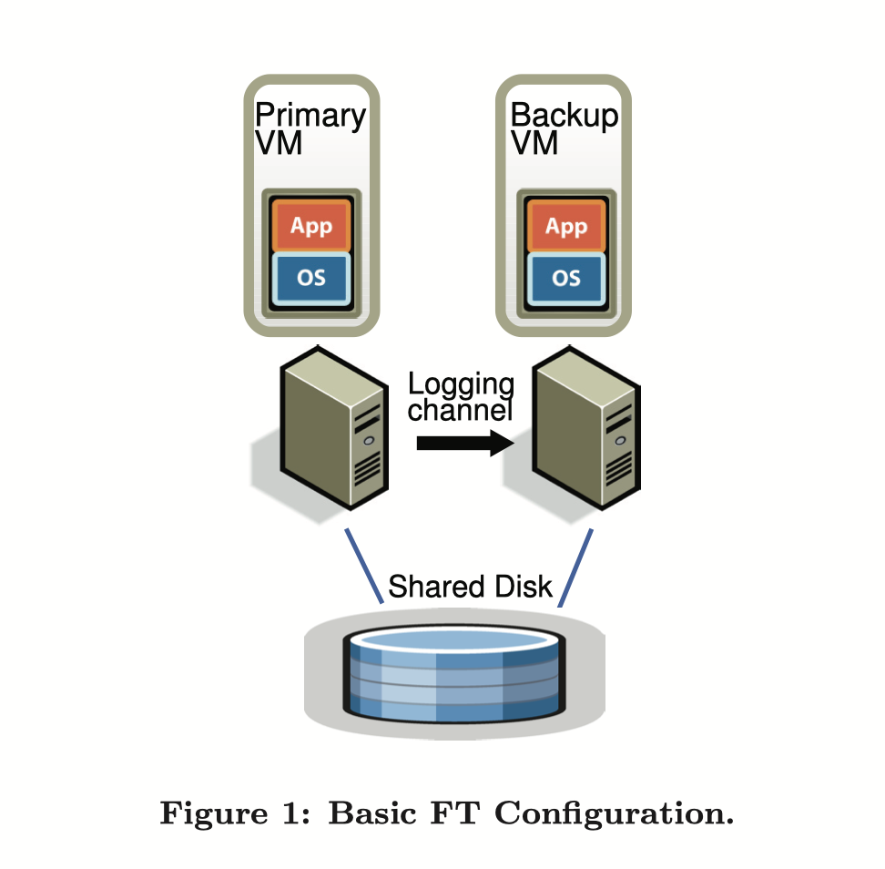
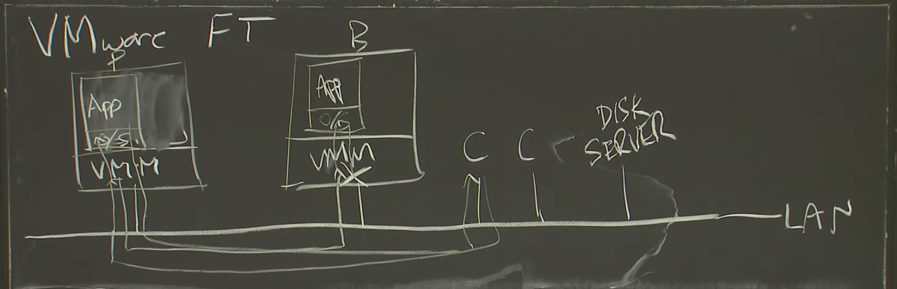

# Primary-Backup Replication

> 来源：https://pdos.csail.mit.edu/6.824/schedule.html  
> LEC 4：Primary-Backup Replication  
> Preparation：《The Design of a Practical System for Fault-Tolerant Virtual Machines》

# 一. 概览

本次介绍的内容主要来自于VMvare公司的一篇论文，他们实现了在虚拟机上的主备复制容错系统。

可容错的意思是，服务器遭遇外部的错误，不是程序本身的错误，比如停电了，服务器过热产生的宕机，但是还想提供服务。

分布式系统设计中最关键的就是容错机制（Failure Tolerance）。这是因为通常情况下，一个客户端（Client）的请求（Request）会被发送至主服务器（Primary）上。而假如Primary挂掉了，那么该Request会被继续分散到备份服务器（Backup）上。而在攻城狮辛辛苦苦修理挂掉的服务器时，原先的Backup仍然要坚持响应Client的请求。当服务器修好后，Primary和Backup上的资料自然会不一致了，这时候如果没有一种有效地手段保证两个服务器继续保持同步状态，无疑会造成很严重的问题~

# 二. 基本原理

为实现可容错的服务器，主从备份是一种常用的解决方案：在开启了主动备份的系统中，备份服务器的状态需要在几乎任何时候都与主服务器保持一致，这样当主服务器失效后备份服务器才能立刻接管。

# 三. 技术难点

## 难点一：如何实现状态同步

实现主备间状态同步的方式有以下两种：

1. **State Transfer（状态转移）**：主服务器将状态的所有变化都传输给备份服务器，包括CPU，内存，以及IO设备的状态。这样的方案会较为简单，但需传输的数据量较大。
2. **Replicated State Machine（备份状态机）**：将需要备份的服务器视为一个确定性状态机（deterministic state machine），然后将主、备服务器以相同的状态启动，保障他们以相同的顺序接收到相同的输入，这样他们就会进入相同的状态，给出相同的输出。主、备服务器之间的传送的状态是指输入和操作。这样的方案比较复杂，但是需要传输的数据量会小很多。

不考虑成本的条件下两个方法都可以用，但是由于主服务器与备份服务器有一定的空间距离（这样发生比如像停电这样的故障的时候才不会同时影响到两个服务器），并且往往也是通过网络来传输的，如果能够实现备份状态机这个方法是最好的。

## 难点二：如何保证服务器是确定性状态机

在论文中提到的保障性手段主要有两个：虚拟机和“额外操作”。

实施协调以确保确定性地执行**物理服务器**是困难的，尤其随着处理器频率的提升。但是由于虚拟机运行在Hypervisor（虚拟机管理程序）之上的抽象机器，通过 Hypervisor 这一隔离层便能很好地将非确定性的输入转变为确定性的输入。虚拟机相较于物理机有一定的优势。

绝大多数的服务器或者服务有一些操作是不确定的（如外部中断之类的），因此必须要有一些额外的操作来保证主备服务器是同步的。但是由于这些额外操作的数量是远小于确定状态的数量的，所以实现起来也比较方便。

# 四. 解决的问题

实现了一个基于虚拟机的主备系统，使服务器之间完成复制备份。

# 五. 如何实现

## 1. 确定性重放（Deterministic Replay）

考虑到虚拟机的很多输入事件本身是不确定的，如时钟中断、网络中断和磁盘中断，这会为在虚拟机上实现状态机方法带来第一个挑战。这个问题可以被细分为三个问题：

1. 正确地捕获所有的输入事件以及它们的不确定性，以确保有足够地信息能够确定性地重放这些事件
2. 正确地在备份虚拟机上重放这些输入事件和不确定性
3. 保证性能不会因此降级

VMware 实现的主从备份方法名为 VMware vSphere Fault Tolerance，简称 VMware FT，它是基于 VMware Deterministic Replay 实现的。Deterministic Replay 解决了上面的前两个问题，而第三个问题则会由 VMware FT 来解决。

Deterministic Replay 会以日志记录的形式记录主服务器接收到的输入（就是log文件），这些日志信息则会由 VMware FT 传输到备份服务器并被重放。

正如上面所提到的那样，**真正的麻烦实际上来源于那些会产生不确定作用的输入**。对于那些不确定的输入操作，Deterministic Replay 会记录足够多的信息，确保其在备份虚拟机上重新执行能够得到相同的状态和输出；而对于那些不确定的输入事件，如定时器、IO 操作完成中断等，Deterministic Replay 则会记录这些事件发生在哪个指令之后，这样在重放时备份服务器便能在指令流中相同的位置重放这些事件。

**不确定的事件有哪些？**  

事件之一是：Inputs，实际上，由于这些服务是专门用来服务于只用网络来通信的世界，所以该系统中输入输出的唯一形式就是网络数据包。这个网络数据包所带给这个系统的结果是数据，以及数据包所带来的中断。这个是日志文件中要记录的，记录中断的时间，中断指令，以及数据，这些要在备份服务器上完全复现。

第二个就是一些奇怪的指令：比如生成随机数的指令。主数据库和备用数据库将从其随机数生成器中获得相同的数字。 所有随机性源均由管理程序控制。 例如，应用程序可以使用当前时间，硬件周期计数器或精确的中断时间作为随机性来源。 在所有这三种情况下，系统管理程序都会在主数据库和备份数据库上拦截相关指令，并确保它们产生相同的值。

此外，论文排除了由于多核产生的不确定事件。这个协议暂时运行在单核系统上面，暂不清楚这个协议是否可以扩展到多核系统和多核计算机上。因为两个核心的指令交错是非确定性的，这样就造成两个服务器输出的不确定。但是VMware在这之后提出了一个可能完全不同的复制系统，这个系统可以在多核系统上运行，但是这个系统所使用的方法可能是状态转移（state transfer），而不是复制状态机（Replicated State Machine）。

## 2. VMware FT

Deterministic Replay 不过是一个可让虚拟机产生可重放日志信息的解决方案，单靠它是还不足以实现虚拟机主从备份的，而 VMware vSphere Fault Tolerance（简称 VMware FT）则是在使用 Deterministic Replay 为虚拟机生成日志信息的基础上实现了主备虚拟机间的同步备份。

首先我们先来看看 VMware FT 主从备份的架构：

如图所示，整个架构由一主一备组成，两个虚拟机运行在两个不同的物理机上，虚拟机的镜像完全相同，通过一个 Logging Channel 传输 Deterministic Replay 产生的日志信息，同时两个虚拟机都能访问一个 Shared Disk。

在更实际一点的场景下，可能是这样的：

设计者对 VMware FT 的核心要求：

> **Output Requirement**: if the backup VM ever tasks over after a failure of the primary, the backup VM will continue executing in a way that is entirely consistent with all outputs that the primary VM has sent to the external world.  
> 
> **输出要求**：若在主虚拟机失效且由备份虚拟机接手后，备份虚拟机必须以一种与原主虚拟机已发送到外部的输出完全一致的方式运行.

可见在发生故障切换后，VMware FT **并不要求**备份虚拟机一定要以与主虚拟机完全一致的方式继续运行，只需要它能够一致地处理所有已经发出的输出即可。

为了实现这个核心要求，最简单的解决方案就是延迟主虚拟机的输出操作，直到备份虚拟机已经接收到所有至少足以让它重放至该输出操作的所有日志信息。要做到这一点，简单地确保备份虚拟机已接收到该输出操作之前的所有日志信息是不够的，因为如果主虚拟机在完成输出操作后立刻失效的话，备份虚拟机在重放该输出操作前仍可能出现其他不确定的事件（如计时中断）导致备份虚拟机进入其它执行路径。

为此，VMware FT 实现了如下功能：

> **Output Rule**: the primary VM may not send an output to the external world, until the backup VM has received and acknoledged the log entry associated with the operation producing the output.
>
> **输出规则**：主虚拟机必须延后将输出发送到外部世界的动作，直到备份虚拟机已经接收并 ack 与产生该输出的操作相关联的日志信息.

由此，需要进行输出前，主备虚拟机间的时序关系大约是这样的：

值得注意的是，这项规则并不要求主虚拟机在接收到来自备份虚拟机的 ack 之前完全停止运行 —— 这项规则仅要求主虚拟机延迟输出操作。

由于 VMware FT 在处理与输出操作相关的日志时没有采用二阶段提交机制，VMware FT 并不保证输出是只有一次（Exactly Once）的。所幸的是，网络基础服务（如 TCP）通常能很好地处理重复的包，对磁盘同一位置的重复写入往往也不会有什么问题。

## 3. 主从切换

前面所说的全都是主服务器和备份服务器如何状态同步的问题，那么如果两者之一发生故障应该怎么办。

首先，VMware FT 会使用两种不同的方式来检测虚拟机节点的失效事件：

1. 两个虚拟机所寄宿的物理机会相互之间发送 UDP 心跳信息，以判断对方是否仍存活
2. 持续监控 Logging Channel 上的流量：由于周期定时中断的存在，主虚拟机发往备份虚拟机的日志和备份虚拟机发往主虚拟机的 ack 应该是持续不断的，信息中断即意味着节点的失效。

如果UDP心跳或者Logging Channel 上的流量停止了超过一个特定的时长（一般是几秒钟），就会判定发生了错误。

如果备份虚拟机失效，主虚拟机就会 go live，即退出日志记录模式，不再产生和发送日志信息，并以普通的方式继续运行；如果主虚拟机失效，备份虚拟机就会在消费完 Logging Channel 中的所有日志信息后升级为主虚拟机并 go live，开始对外界发送输出。

我们前面提到过，这些服务器与外界交流的方式都是通过网络，那么备份服务器在升级为主服务器之后，如何让别人知道它是主服务器呢。还是下面这张图，两个服务器都处在同一个局域网中，一个局域网中的通信基本上是只用MAC地址的，此时只要备份服务器主动广播一下主服务器所拥有的IP地址对应的MAC是它的就行。

然而上述两种方案无法避免架构在主从虚拟机间发生网络隔离时出现 Split-Brain Syndrome（裂脑综合征，指在连接大脑左右脑的胼胝体受损到一定的程度后发生的因左右脑冲突导致的症状，在分布式系统领域指一个集群中存在多个 Master 角色所带来的问题）：主从虚拟机间的网络不通会导致备份虚拟机误以为主虚拟机已经宕机而自动升级为主虚拟机，导致集群中存在两个主虚拟机。

为了解决这个问题，无论主备，虚拟机在 go live 前首先会对存储在 Shared Disk 上的一个字段进行原子的 test-and-set 操作：如果操作成功，那么它便可以 go live；否则就意味着已经有另一个虚拟机 go live，它便会立刻关闭自己（形如因自身失效而导致另一个虚拟机 go live）。