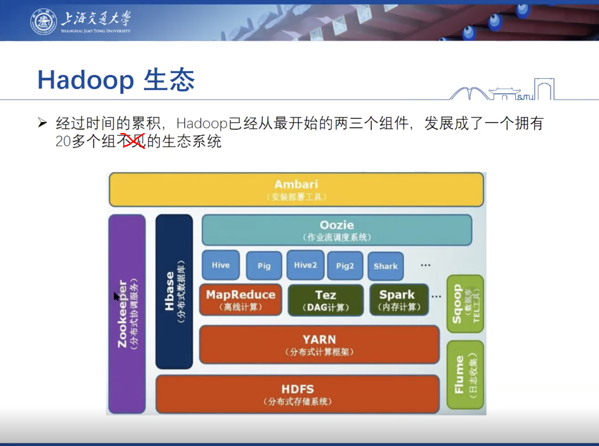
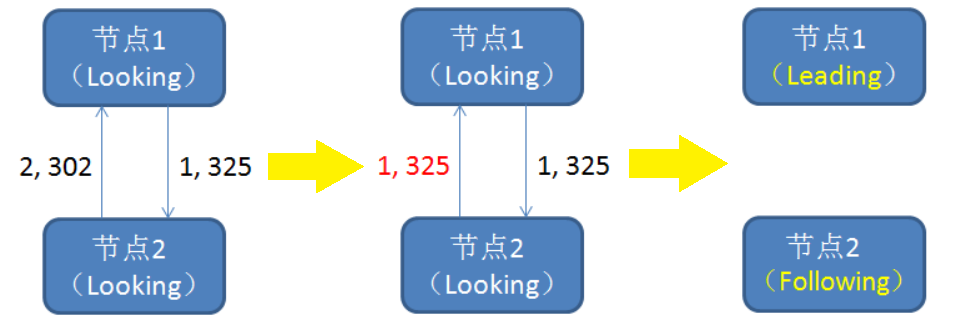
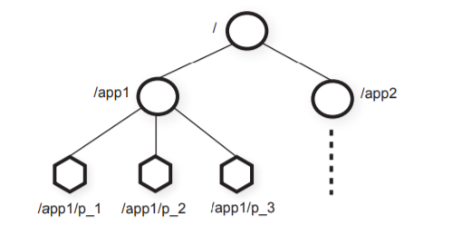
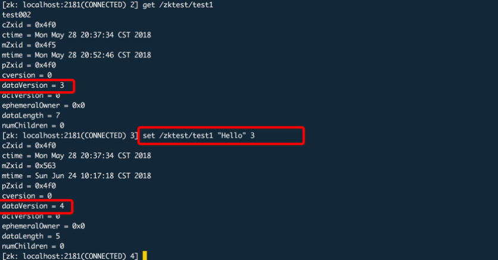
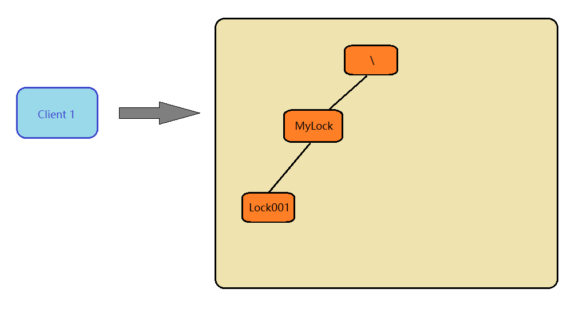
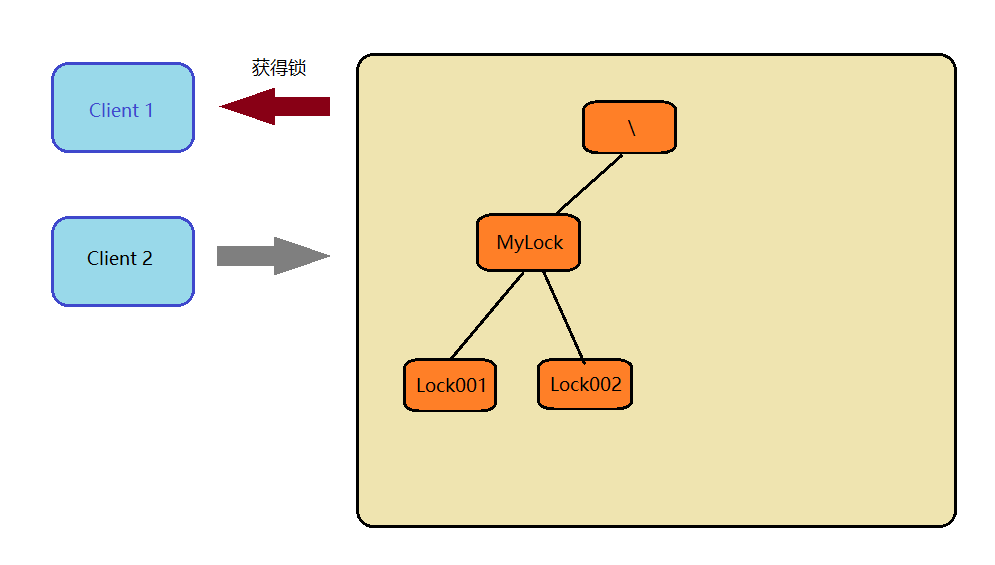
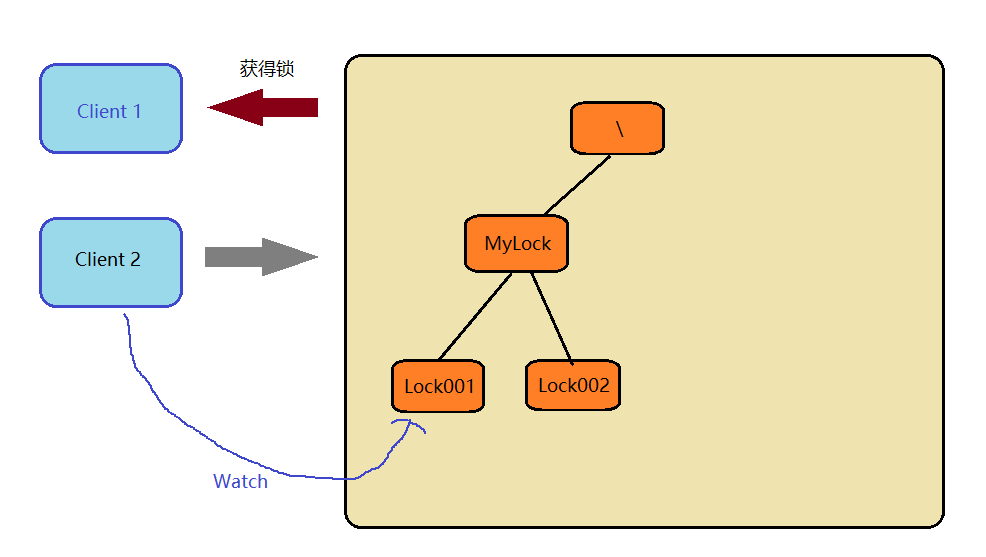
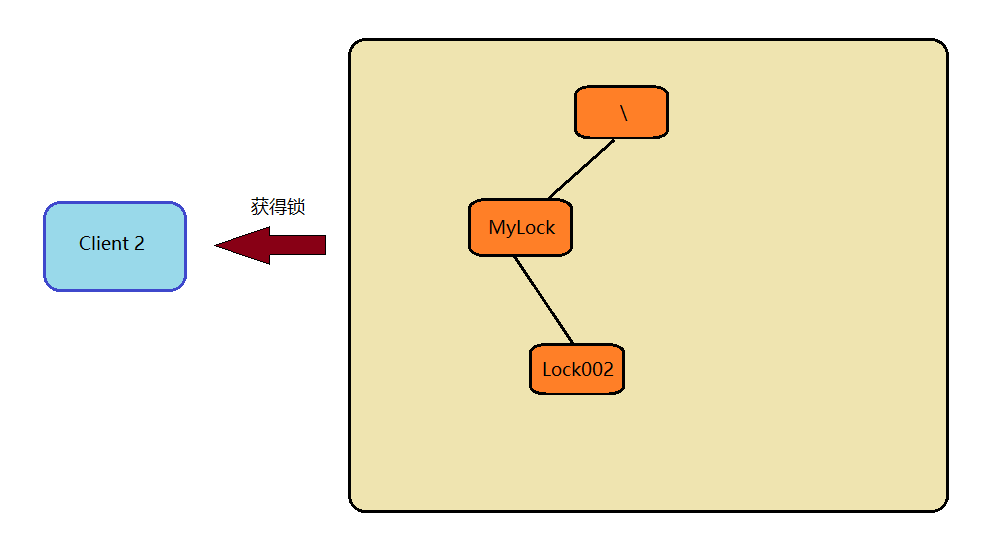

# ZooKeeper

> 来源：https://pdos.csail.mit.edu/6.824/schedule.html  
> LEC 8：ZooKeeper  
> Preparation：《ZooKeeper: Wait-free coordination for Internet-scale systems》

# 一. 为什么要有分布式协调系统

大规模分布式系统需要解决各种类型的协调需求：

* 当集群中有新的进程或服务器加入时，如何探测到它的加入？如何能够自动获取配置参数？
* 当配置信息被某个进程或服务器改变时，如何实时通知整个集群中的其他机器？
* 如何判断集群中的某台机器是否还存活 ？
* 如何选举主服务器，主服务器宕机，如何从备选服务器中选出新的主服务器？

以上问题的本质都是分布式系统下协调管理的问题，目前比较有名的协调系统有Google的Chubby，Yahoo的Zookeeper（对于协调系统来说其客户端往往是分布式集群）。


# 二. ZooKeeper

> ZooKeeper直译过来就是“动物园管理者”的意思。ZooKeeper起源于雅虎研究院的一个研究小组，在立项之初，考虑到之前内部很多项目都是使用动物的名字来命名的（例如著名的Pig项目），雅虎的工程师希望这个项目也取一个动物的名字。时任研究院的首席科学家Raghu Ramakrishnan开玩笑说：“这样下去，我们这都要变成动物园了！”此话一出，大家纷纷表示就叫动物园管理员吧---因为各个以动物命名的分布式组件放在一起，雅虎的整个分布式系统看上去就像一个大型动物园，而ZooKeeper正好要用来进行分布式环境的协调---于是，ZooKeeper的名字也就由此诞生了。

ZooKeeper是一个开源的分布式**协调**服务。ZooKeeper的设计目标是将那些复杂且容易出错的分布式一致性服务封装起来，构成一个高效可靠的原语集，并以一系列简单易用的接口提供给用户使用，相比于其他分布式锁服务（如Chubby），ZooKeeper给用户的自由度更高。

在后续发展中，Apache ZooKeeper成为Hadoop等分布式框架所使用的有组织服务的标准。下图来源于易大师7.7组会分享内容（Massive data processing related topics）：



ZooKeeper是一个典型的分布式数据一致性解决方案，分布式应用程序可以基于ZooKeeper实现诸如数据发布/订阅、负载均衡、命名服务、分布式协调/通知、集群管理、Master选举、分布式锁和分布式队列等功能。


# 三. ZooKeeper怎么实现分布式一致性协调

Zookeeper集群服务由多台服务器构成（最少3台），通过选举产生1台主服务器，和多台从服务器。客户端可从任何一台服务器读取到所需数据，但要写入或修改数据必须在主服务器上执行，若客户端连接从服务器执行写入或更新数据，从服务器会将请求转发给主服务器，由主服务器完成数据的写入或更新，并将相应的信息通知给所有从服务器，从服务器据此更新自己的数据，并向主服务发送确认信息，主服务器在接受到半数或以上**从服务器**的确认信息后，才通知客户端写入或更新操作成功。Zookeeper集群一般由2n+1（奇数）台服务器组成，其最大能容忍n台从服务器发生故障。Zookeeper通过定期保存的快照信息和日志信息来实现其容错能力。

## ZAB协议

为了保证主从节点的数据一致性，Zookeeper采用了ZAB协议，这种协议非常类似于一致性算法Paxos和Raft。ZAB（即zookeeper atomic broadcast）有效解决了zookeeper集群崩溃恢复，以及主从同步数据的问题。

在学习ZAB之前，我们需要首先了解ZAB协议所定义的三种节点状态：
* Looking ：选举状态。
* Following ：Follower节点（从节点）所处的状态。
* Leading ：Leader节点（主节点）所处状态。

我们还需要知道最大ZXID的概念：
  > 最大ZXID也就是节点本地的**最新事务编号**，包含epoch和计数两部分。epoch是纪元的意思，。为了保证事务的顺序一致性，ZooKeeper 采用了**递增**的事务id号（zxid）来标识事务。所有的提议（proposal）都在被提出的时候加上了ZXID。实现中ZXID是一个64位的数字，它高32位是epoch（相当于Raft算法选主时候的term）用来标识leader关系是否改变，每次一个leader被选出来，它都会有一个新的epoch=（原来的epoch+1），标识当前属于那个leader的统治时期。低32位用于递增计数。

假如Zookeeper当前的主节点挂掉了，集群会进行崩溃恢复。ZAB的崩溃恢复分成三个阶段：  
1. **Leader election**：选举机制如下图所示：
   
   ①选举阶段，此时集群中的节点处于Looking状态。它们会各自向其他节点发起投票，投票当中包含自己的服务器ID和最新事务ID（ZXID）。②接下来，节点会用自身的ZXID和从其他节点接收到的ZXID做比较，如果发现别人家的ZXID比自己大，也就是数据比自己新，那么就重新发起投票，投票给目前已知最大的ZXID所属节点。③每次投票后，服务器都会统计投票数量，判断是否有某个节点得到半数以上的投票。如果存在这样的节点，该节点将会成为准Leader，状态变为Leading。其他节点的状态变为Following。
2. **Discovery**：发现阶段，用于在从节点中发现最新的ZXID和事务日志。此举是为了防止某些意外情况，比如因网络原因在上一阶段产生多个Leader的情况。所以这一阶段，Leader集思广益，接收所有Follower发来各自的最新epoch值。Leader从中选出最大的epoch，基于此值加1，生成新的epoch分发给各个Follower。
各个Follower收到全新的epoch后，返回ACK给Leader，带上各自最大的ZXID和历史事务日志。Leader选出最大的ZXID，并更新自身历史日志。
3. **Synchronization**：同步阶段，把Leader刚才收集得到的最新历史事务日志，同步给集群中所有的Follower。只有当半数Follower同步成功，这个准Leader才能成为正式的Leader。自此，故障恢复正式完成。

## ZooKeeper的写入

写入的流程如下：
1. 客户端发出写入数据请求给任意Follower。
2. Follower把写入数据请求转发给Leader。
3. Leader采用二阶段提交方式，先发送Propose广播给Follower。
4. Follower接到Propose消息，写入日志成功后，返回ACK消息给Leader。
5. Leader接到半数以上ACK消息，返回成功给客户端，并且广播Commit请求给Follower。

## ZooKeeper的数据结构

Zookeeper维护一个类似文件系统的数据结构`Znode`：



ZooKeeper的数据结构就像一个精简的文件系统，不同的是每个节点拥有它自己或者它下面子节点相关联的数据。ZooKeeper中必须使用绝对路径也就是使用“/”开头。比如使用`get`命令读取结点里面的内容：
```
get /app1
```

Znode的结点类型有：持久节点，持久顺序节点，临时节点，临时顺序节点。Znode**同一路径下的节点名称不能重复**。

Znode具有如下特性：

1. Watches：客户端可以在节点上设置Watches（可以叫做监视器）。当节点状态发生变化时，就会触发监视器对应的操作，当监视器被触发时，ZK服务器会向客户端发送且只发送一个通知
2. 数据访问：ZooKeeper上存储的数据需要被原子性的操作（要么修改成功要么回到原样）。

Znode可以通过`set`命令来修改结点，如：
```
set /app1/p_3 "Hello" 3
```
这个命令是将/app1/p_3里面的内容修改为Hello，最后面那个3代表着版本号，当一个客户端要对某个节点进行修改时，必须提供该数据的版本号，当节点数据发生变化是其版本号就会增加。如下图所示：



版本号是只能递增的，每次修改后版本号都加一，同时ZXID也会变。

**版本号与ZXID的区别**：ZXID是全局有序的，每次更新都会产生一个新的。如果zxid1的值小于zxid2，那么说明zxid2发生的改变在zxid1之后。zxid是一个唯一的事务ID，具有递增性，一个znode的建立或者更新都会产生一个新的zxid值，具体时间有3个cZxid（节点创建时间）、mZxid（该节点修改时间，与子节点无关）、pZxid（该节点的子节点的最后一次创建或者修改时间，孙子节点无关）。

对节点的每次操作都会使节点的版本号增加，有三个版本号dataversion（数据版本号）、cversion（子节点版本号）、aclversion（节点所拥有的ACL版本号）（ACL即权限控制）。


# 三. 技术难点

## 如何保证数据一致

Zookeeper的任何一台从服务器也能为客户端提供**读服务**是其高吞吐量的主要原因，但另一方面也导致了一个问题：客户端可能会读到过期的数据。即客户端在从服务器上读数据时，主服务器已经修改了数据，还来不及将修改后的数据通知从服务器。

zookeeper没有完全线性一致化的保证，但是也有两个保证：

> **可线性化写**（Linearizable writes）：所有**更新**ZooKeeper状态的请求都是可序列化的，并且遵循优先级。
> 
> **客户请求序列先进先出** (FIFO client order) ：来自给定客户端的**所有请求**均按客户端发送的顺序执行。

客户端在修改某些结点之后（产生版本号，版本号单调递增），集群会进行一些同步，当这个客户端下一次访问集群时，会比较版本号，如果版本号不比上次的小，就访问成功。

ZooKeeper只能保证自己写进去的最新的东西一定能看到，但是不保证别人写进去的最新的东西一定能被看到。

可以用sync操作来保证自己看到的是最新的。sync操作类似于一个写操作，只要在读操作之前sync一下，就能确保我之后的读操作是读到的最新的。


# 四. 解决的问题

## 数据发布/订阅

前面我们提到，Znode有个watches特性，如果一个客户端对一个结点设置了watch，如：


就会把这个（客户端，结点）对插入一个哈希表中，当这个结点发生了更新之后，就会给客户端发消息。

可以利用这个机制来进行数据发布/订阅。

## 配置文件统一管理

在分布式集群的工程中,通常由很多服务部署在不同的服务上,每个服务都有自己的配置信息,如果需要修改某个配置,则可能需要对多态服务器进行配置的修改,是非常不方便的。那么就可以使用ZooKeeper帮助我们进行统一的配置文件管理。

现在把这些配置全部放到 ZooKeeper 上去，保存在 ZooKeeper 的某个目录节点 ZNode 中，然后所有相关应用程序对这个目录节点进行监听，一旦配置信息发生变化，每个应用程序就会收到 ZooKeeper 的通知，然后从 ZooKeeper 获取新的配置信息应用到系统中。

## 分布式锁

ZooKeeper可以利用Znode来进行分布式锁的设计。

比如首先，在ZooKeeper当中创建一个**持久节点** MyLock 。当第一个客户端想要获得锁时，需要在 MyLock 这个节点下面创建一个**临时顺序节点**。



创建完成后就比较MyLock下面哪个结点是最先来的，client 1发现是自己，然后就获得了锁。随后client 2来了，也在MyLock下面创建一个临时顺序节点。



此时它的比较结果是，Lock002在Lock001之后，有人已经获得锁了，所以它应该等待，并且对前一个结点进行监听。



由于临时结点在客户端主动删除，退出，或者宕机的时候会自动删除，所以在Client 1不使用分布式锁的时候，Client 2会收到通知，然后它就可以获得锁了。

